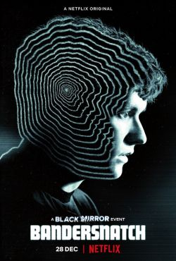
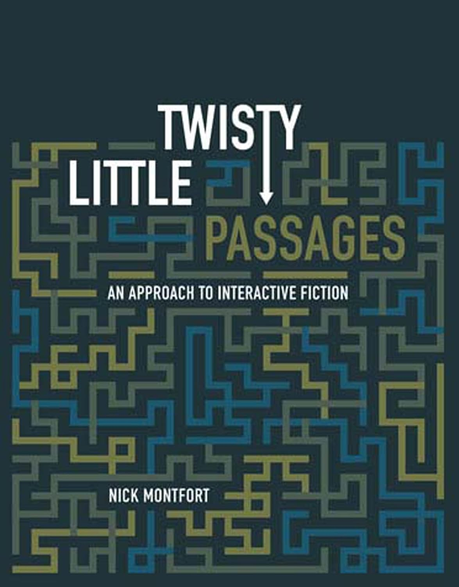
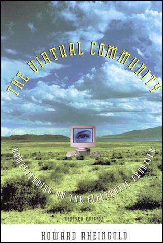

[{.lightbox}](https://annesbirdpoems.blogspot.com/2016/02/the-garden-of-forking-paths.html)

I assume everyone reading this is familiar with those "Choose your own adventure" books that are still popular with kids today? The ones where as you read you reach a choice point where the narrative forks and gives you two possible pathways to continue. Depending on what you choose, you may have to jump ahead to the corresponding section later in the book, because books are laid out in linear fashion. Many of you will probably be familiar with the Black Mirror episode [**Bandersnatch**](https://en.wikipedia.org/wiki/Black_Mirror:_Bandersnatch) on Netflix (now sadly deleted), which uses a similar principle in audiovisual media, or even Bear Grylls's Netflix show [**You vs. Wild**](https://www.netflix.com/title/81977118), which does the same.

::: {.column-margin}

[{.lightbox width=200}](https://en.wikipedia.org/wiki/Black_Mirror:_Bandersnatch)

:::

I don't know much about the history of Choose Your Own Adventure Game---it would be interesting to find out---but as far as I know they pre-date interactive media and are a kind of analog prototype of it. They can probably be traced back to the archetype of what in the 1990s became known as "interactive media": the fantasy board game *Dungeons & Dragons*. As Nick Montfort describes in his book [**Twisty Little Passages**](https://nickm.com/books/twisty_little_passages/) (our first reading assignment), the earliest interactive games like *Adventure* or *Zork* were essentially computer-based implementations of *D&D*. With the system playing the role of dungeon master, you would explore navigable spaces in a text-based immersive environment, pursuing certain goals and initially, at least, interacting with automated characters rather than real people also connected to the system at the same time. Initially for solo players, as early as the 1980s these systems became multi-player, often hosting hundreds of players, and were known by the strange acronym as MUDs, which stands for Multi-User Dungeon (another *D&D* reference). Known at the time as "text-based virtual reality," these systems were the prototype for what we now know by an even more ugly and unpronounceable acronym, MMORPGs (Massively Multiplayer Online Role-Playing Games).

::: {.column-margin}

[{.lightbox width=200}](https://nickm.com/books/twisty_little_passages/)

:::

In terms of the history of interactive media, it is initially useful to differentiate between two separate but intertwining timelines: 

- the *Adventure* timeline, which involved solo puzzle games, which by the 1990s had developed into a new form of creative writing and research field known as **Hypertext**. The literary archetype for this trajectory was the Argentinian fiction writer Jorge Luis Borges's classic 1941 short story [**"The Garden of Forking Paths"**](https://en.wikipedia.org/wiki/The_Garden_of_Forking_Paths), about the idea of an infinite garden or maze. In the 1990s hyperfiction (i.e. non-linear interactive fiction) writing developed into a new genre in its own right, using open-source tools such as Michael Joyce's [**Storyspace**](https://www.eastgate.com/storyspace/index.html) and [**TWINE**](https://twinery.org/) (both still widely used for authoring hyperfiction today). 

At the time of writing, there is a large and very active creative community online organized around hyperfiction. Good places to find out more are the [**People's Republic of Interactive Fiction**](https://pr-if.org/) at MIT (of which Nick Montfort is a founder member), or M.C. DeMarco's excellent [**blog and website**](https://mcdemarco.net/tools/).

- the second, more familiar historical timeline taken by interactive media is what might be called the *Warcraft* trajectory of multi-player environments, which leads from MUDs (1980-1900s) to MMORPGs and MOBAs (Multiplayer Online Battle Arena). This includes not just online gaming but also real-world embodied practices derived from it, known as LARPing (Live-Action Roleplay). 

Between MUDs and MOBAs, the 1990s was also the period of yet another acronym: MOOs, in fact an acronym of an acronym since it stands for "MUD, Object-Oriented" because of the modular coding language that was used for world-building. As we'll see, MOOs were one form of what became known as **virtual communities** (after Howard Rheingold's pathbreaking [**book of the same name**](https://www.rheingold.com/vc/book/)), which at the time also included Bulletin-Board Systems (BBS) such as the WELL in San Francisco or ECHO in New York. Whereas MUDs were primarily combat-based, MOOs were socially oriented, online spaces similar to bars or clubs where people from anywhere in the world with an internet connection could craft their own spaces and just hang out together in a text-based immersive environment (as we'll also see, it was not until later that these spaces would become graphics-based). 

::: {.column-margin}

[{.lightbox width=200}](https://direct.mit.edu/books/book/2147/The-Virtual-CommunityHomesteading-on-the)

:::

With the widespread fascination with retrogaming and retro media more generally, it isn't surprising that recent years have seen a resurgence of interest in these old-school interactive games. Early adventure games like **Zork** can now be played straight out of a web browser, while mobile apps like [**Frotz**](https://apps.apple.com/us/app/frotz/id287653015) have made it possible to play interactive games on a cellphone. There are even new games being developed that make it possible to experience old-school text-based gaming on an iPhone, like [**A Dark Room**](https://en.wikipedia.org/wiki/A_Dark_Room).

We're getting ahead of ourselves here but look-ahead is in fact one of the key principles of interactivity itself. My favorite definition of interactivity today is still Sandy Stone's definition in their mid-1990s book *The War of Desire and Technology at the Close of the Mechanical Age*. The relevant section in the book's introduction is in many ways still as relevant today as when it was written, and is worth reading in full. 

I look forward to hearing your thoughts about it, as well as on any of the preceding discussion, with you on Discord this week!

> I don't want to make this a paradise-lost story, but the truth is that the definitions of interactivity used by the early researchers at MIT possessed a certain poignancy that seems to have become lost in the commercial translation. One of the best definitions was set forth by Andy Lippman, who described interaction as mutual and simultaneous activit on the part of both participants, usually working toward some goal---but, he added, not necessarily. Note that from the beginning of interaction research the idea of a common goal was already in question, and in that fact inheres interaction's vast ludic dimension.
>
> There are five corollaries to Lippman's definition. One is **mutual interruptibility**, which means that each participant must be able to interrupt the other, mutually and simultaneously. Interaction, therefore, implies conversation, a complex back-and-forth exchange, the goal of which may change as the conversation unfolds.
>
> The second is **graceful degradation**, which means that unanswerable questions must be handled in a way that doesn't halt the conversation: "I'll come back to that in a minute," for example.
>
> The third is **limited look-ahead**, which means that because both parties can be interrupted there is a limit to how much of the shape of the conversation can be anticipated by either party.
>
> The fourth is **no-default**, which means that the conversation must not have a pre-planned path; it must develop fully in the interaction.
>
> The fifth, which applies more directly to immersive environments (in which the human participant is surrounded by the simulation of a world), is that the participants should have the impression of an **infinite database**. This principle means that an immersive interactional world should give the illusion of not being much more limiting in the choices it offers than an actual world would be. In a nonimmersive context, the machine should give the impression of having about as much knowledge of the world as you do, but not necessarily more. This limitation is intended to deal with the Spock phenomenon, in which more information is sometimes offered than is conversationally appropriate.

> Thus interactivity implies two conscious agencies in conversation, playfully and spontaneously developing a mutual discourse, taking cues and suggestions from each other as they proceed.

<small>---Sandy Stone, "Sex, Death, and Machinery" (in *The War of Desire and Technology at the Close of the Mechanical Age*, 1995): 10-11.</small>

***
