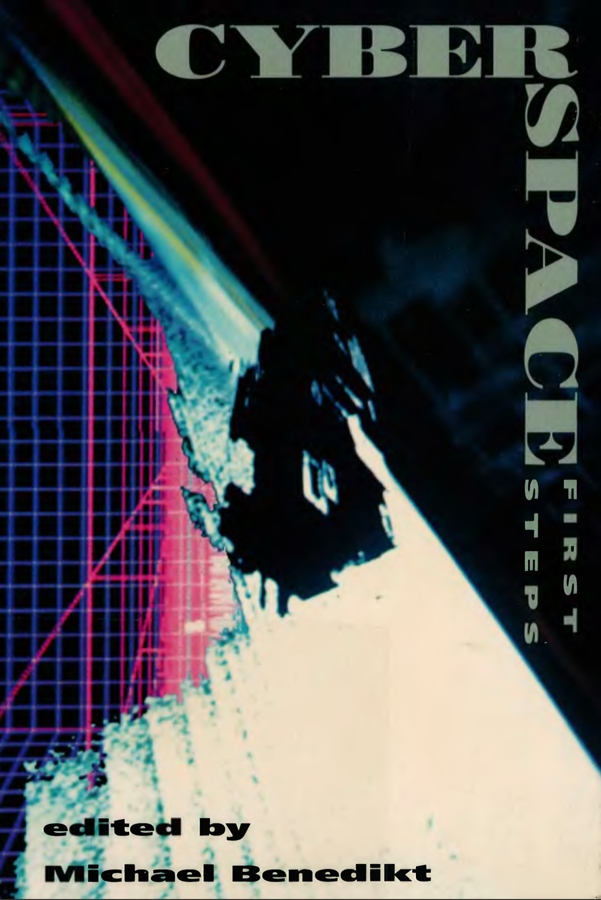
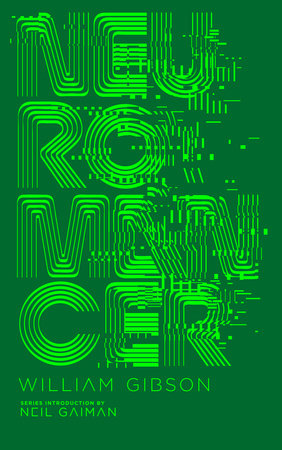
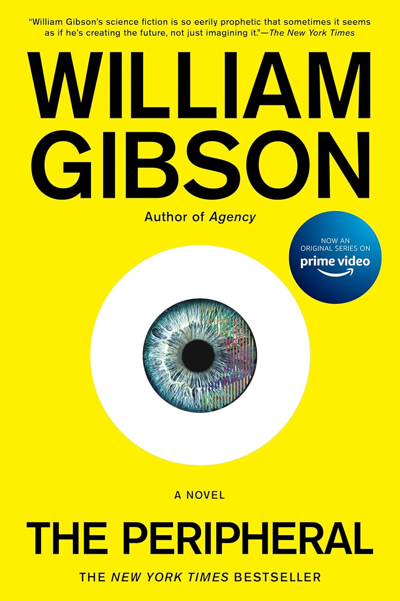

In the 1990s we used to call it "cyberspace".

::: {.column-margin}

[{.lightbox width="200"}](pdf/Benedikt_Michael_ed_Cyberspace_First_Steps_1991.pdf)

<small>Michael Benedikt, ed., *Cyberspace: First Steps* (Cambridge: MIT Press, 1991).</small>

:::

It was in Michael Benedikt's anthology that I first discovered Lukasfilms' *Habitat*, regarded as the first MMORPG. Created by Randall Farmer and Chip Morningstar, the game dates from the late 1980s and as the first graphics-based interactive gameworld was several decades ahead of its time.

The state-of-the-art term in the early 1990s, cyberspace seems to have now passed into obsolescence, along with pretty much every other derivate term starting with "cyber" (who remembers the cybercafe?) - other than cyberpunk, now officially enshrined as an [internet aesthetic](https://aesthetics.fandom.com/wiki/Cyberpunk). 

The origin of the term cyberspace itself is usually credited to the Canadian science fiction novelist William Gibson, whose novel [*Neuromancer*](https://www.penguinrandomhouse.com/books/538861/neuromancer-by-william-gibson/) (1984) was one of the founding works of the genre that became known as cyberpunk. Much of the action of Gibson's novel takes place in cyberspace---a three-dimensional, navigable datascape accessed through head-mounted devices that anticipated the first clunky Virtual Reality headsets of the subsequent decade. Gibson continued to explore the concept of cyberspace in his subsequent novels, right up to *The Peripheral* (2014), the source for the excellent [Amazon Prime series](https://www.amazon.com/The-Peripheral/dp/B0B8NCT5C2/ref=sr_1_1?crid=262W29817SLUV&dib=eyJ2IjoiMSJ9.wQK0rm7N3S7YexdzCJjoZqutvuilBN-2RMXEevTastHFJaBhVKI_o9FV1fu8G6E3665THi3nwrHpiSEP3IpIBJBmJTLovIXpNBr1znMxR9Sb9UE3LGwEok-reEnYjqEnByG8IidimQZhgzOKF9ucVJbtb4B3Xz_dFEzgmxfmY70ZIEvicQOCV0Y74GVC5HLa7kEp2RaIk_ZqZD2gWTroLGSptEjHDWWTqz9qp_Tqux0.SN1PV7GQUg4cpsu4PfnXlBrd4VC5Uz9xhewK1AAIwaw&dib_tag=se&keywords=peripheral+tv+series&qid=1767820669&s=books&sprefix=peripheral+tv+series%2Cstripbooks%2C173&sr=1-1-catcorr) of the same name (2022). 

::: {.column-margin}

[{.lightbox width="200"}](https://www.penguinrandomhouse.com/books/538861/neuromancer-by-william-gibson/)

 

[{.lightbox width="200"}](https://www.penguinrandomhouse.com/books/538861/neuromancer-by-william-gibson/)

:::

By the early 1990s, cyberspace had become the catch-all term to describe **immersive environments** of the kind exemplified by *Habitat* and text-based virtual reality systems like MUDs and MOOs (the term MMORPG wasn't coined until later). Perhaps the most significant but easily overlooked element of *Habitat* was its introduction of the **avatar** - a graphic, animated character representing the user controlling it. Avatars already existed in MUDs and MOOs, of course, but only in textual, descriptive form. In *Habitat*, your avatar could interact with those of other users, reinforcing the sense of community that would later reach its height in games like *Animal Crossing* (in many ways, *Habitat* can be seen as a direct precursor of *Animal Crossing*). For all its clunkiness, *Habitat* was a world that you could live in, anticipating so many of the MMORPGs from 2000 to the present. 

::: {.column-margin}





:::

There were two key differences bewteen *Habitat* and *Myst*, the graphics-based interactive video game that developed around the same time (1993). The first was that whereas *Habitat* was a multi-player, social world, *Myst* was a solo game in which the user explored a navigable space (the island, with all its secret rooms, passages, and nooks and crannies)---but alone. 

The other key difference, easily overlooked, was about what could be called **embodiment**: whereas *Habitat* was a **third-person** world in which the user controlled their avatar from the outside, *Myst* was a **first-person** game in that the viewpoint from which the game was experienced was that of the avatar itself, by definition unseen in that we were seeing the world through the virtual viewpoint of the avatar itself---in effect, the player *was* the avatar. In *Habitat*, the avatar was like a **puppet** remote-controlled by the player/user, and a ventriloquist's doll that the player/user could speak through via cartoonish speech bubbles; by contrast, in *Myst* the player was (virtually) **emobodied in the world**. So we can see in these two interactive systems the beginnings of the distinction between third-person ((*Habbo Hotel*)) and first-person (*Halo*) games and gameworlds. Of course, the first-person/third-person distinction starts to brak down in later games from *Second Life* to *Minecraft*, where players are embodied in the world (virtual subjective viewpoint) but can also view their own avatar (third-person).

Put *Habitat* and *Myst* together today, and you arguably have the Escape Room: an interesting variant on both in some ways, that is **embodied** (you are physically in the space), collaborative (you are not alone as in *Myst* but have to work with other players) and puzzle-based (although the goal is to **get out** of the simulated world rather than to explore it). 

I also wonder how these interactive worlds and games also anticipate the contemporary popularity of **urban exploration** (aka Urbex), the real-life exploring of abandoned and/or ruined buildings. We already know that virtual worlds like MMORPGs bleed into real-world social practices like LARPing, so it's tempting to think about how urban exploration can also be seen as a real-world enactment of the kind of exploration of virtual fantasy worlds that has been going on since *Adventure* and *Zork*.[On LARPing, see Lizzie Stark, *Leaving Mundania: Inside the Transformative World of Live Action Role-Playing Games* (Chicago: Chicago Review Press, 2012).]{.aside}

And don't even get me started on the Backrooms and what are now called liminal spaces ;) Certainly the eerie quiet of *Myst* is a good example of what would now be called a liminal space.

::: {.column-margin}



:::

If you're interested in trying out *Habitat* or *Myst* beyond the YouTube play-throughs, you can try out ports of them here:

- [*NeoHabitat*](https://github.com/frandallfarmer/neohabitat/blob/master/README.md)
- [*Myst: Masterpiece Edition*](https://store.steampowered.com/app/63660/Myst_Masterpiece_Edition/) (Steam)

I couldn't get the app version of *Habitat* to connect to the server on my Mac, but perhaps you'll have more luck on Windows? The version of *Myst* should work just fine though.

For more on different ways to play *Myst* today, see [this article](https://medium.com/@andrewblackledge/all-the-ways-to-experience-myst-as-of-2021-16cc7b524e09).

Take them for a test drive and tell me what you think!
