[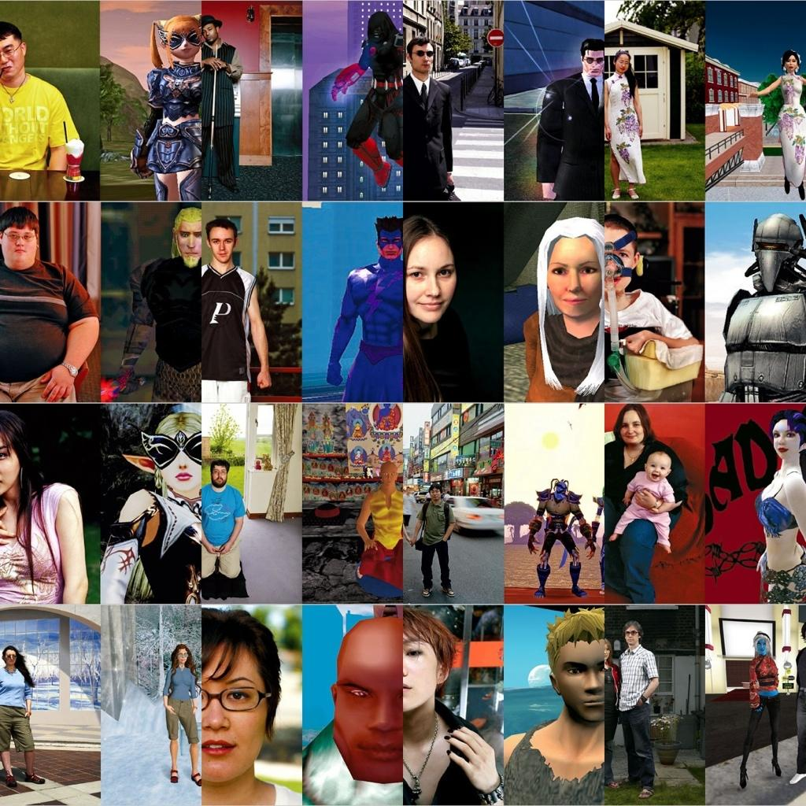](https://www.nytimes.com/slideshow/2007/06/15/magazine/20070617_AVATAR_SLIDESHOW_index.html)

::: {.column-margin}

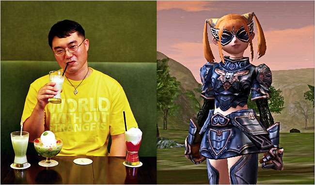{.lightbox group="avatars" width=50}
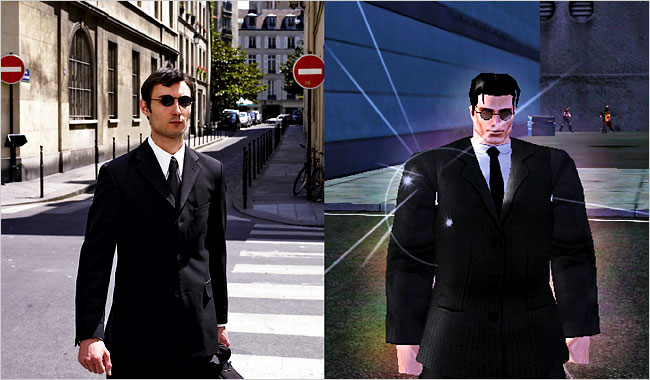{.lightbox group="avatars" width=50} {.lightbox group="avatars" width=50}   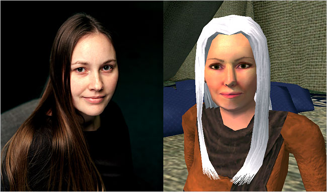{.lightbox group="avatars" width=50} 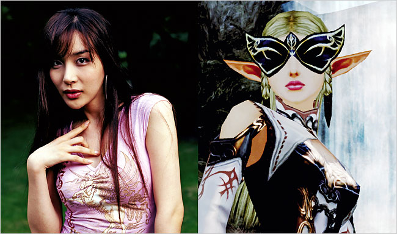{.lightbox group="avatars" width=50}  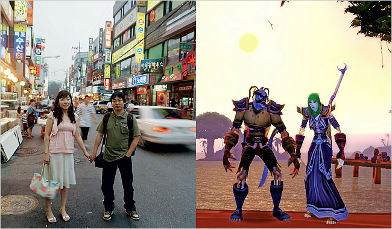{.lightbox group="avatars" width=50} 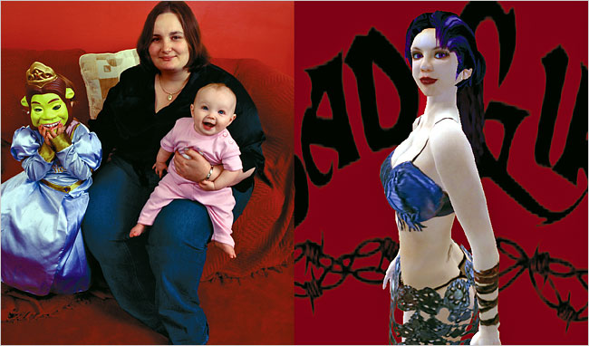{.lightbox group="avatars" width=50}
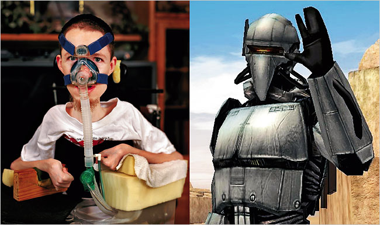{.lightbox group="avatars" width=50}
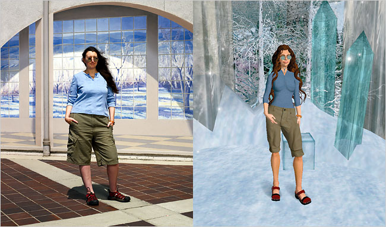{.lightbox group="avatars" width=50}
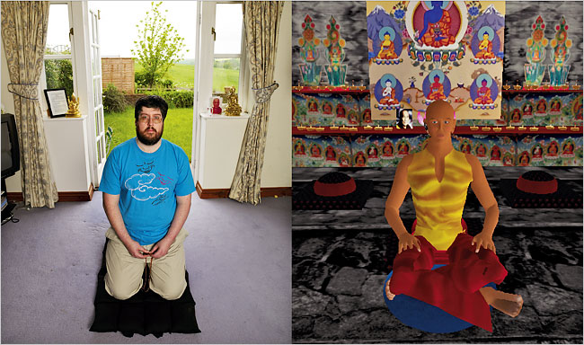{.lightbox group="avatars" width=50}
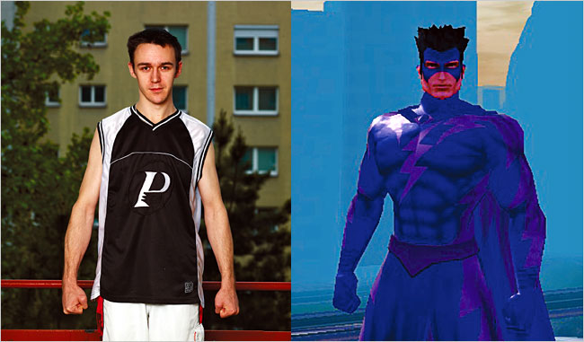{.lightbox group="avatars" width=50} 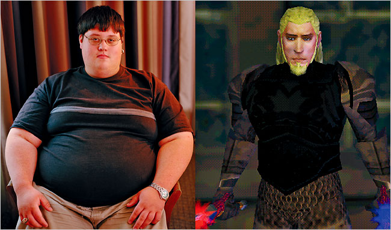{.lightbox group="avatars" width=50}
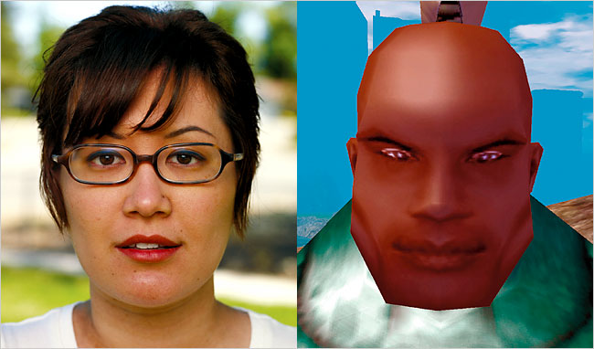{.lightbox group="avatars" width=50}
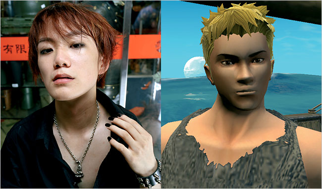{.lightbox group="avatars" width=50}
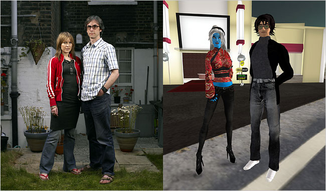{.lightbox group="avatars" width=50}
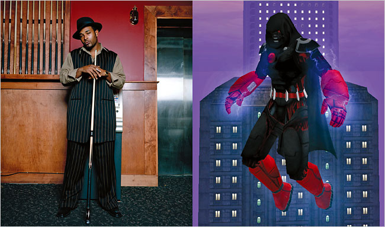{.lightbox group="avatars" width=50}

 

<small>Thomas Malaby, *Making Virtual Worlds: Linden Labs and Second Life*:

 

- "[The Product: Second Life, Capital, and the Possibility of Failure in a Virtual World](pdf/malaby-second-life-ch1.pdf)" (ch. 1)
- "[Knowing the Gamer from the Game](pdf/malaby-second-life-ch3.pdf)" (ch. 3)
- "[References](pdf/malaby-second-life-references.pdf)"

[Second Life](https://www.secondlife.com/)

Watch: [*LIFE 2.0*](https://drive.google.com/file/d/1yGMe4qI1jQ4aGn_5epNQsXPUYku-rC7A/view?usp=sharing)</small>

:::

<small>[Double Agents](https://www.nytimes.com/slideshow/2007/06/15/magazine/20070617_AVATAR_SLIDESHOW_index.html)" (*New York Times*, 15 June 2007). Photographs: Robbie Cooper.</small>

I\
**Avatar**: a computer-generated, graphic (i.e. non-photorealistic), usually animated representation of the self commonly used in computer game worlds and other digital, networked environments,which may be two- or three-dimensional; a kind of digital alter ego. 

::: {.column-margin}



<small>[*1000 Avatars* installation](https://1000avatars.wordpress.com/), *Second Life*, n.d.</small>

:::

II\
While an avatar’s graphic face or body may resemble that of its human counterpart, there is no particular reason why this should be so; indeed, avatars typically take the form of imaginary (often idealised) representations drawn from fantasy, encouraging roleplay in digital worlds rather than performing as the ‘real’ self, as well as the adoption of multiple personas. An avatar may even be selected from a different species (animal spirits, otherkin) or character type (e.g. pokemon character, robot, zombie).

III\
The line between avatars and the ‘real’ self is blurring: for example, embodied subjects (‘real people’) who participate extensively in massively-multiplayer online role-playing games (MMORPGs) often perform in character at real-world gaming events, mimicking the appearance and behaviour of their digital persona and performing scenarios from digital worlds, (LARPing or live-action roleplay) – a practice which originated in the hobby of historical re-enactment (e.g. WW1). See the documentary [*Monster Camp*](https://www.justwatch.com/us/movie/monster-camp) (2007).

IV\
Avatars can be remotely controlled in real time via hardware (mouse, joystick, keyboard) or software (on-screen) interfaces. They therefore offer varying degrees of disembodied (a.k.a. "virtual") communication, agency, and experience with other remote subjects, as well as the ability to manipulate objects, perform tasks, etc. in the digital world itself. Avatars are thus closer to puppets than characters, which, even when animated, are "pre-programmed" and are not controlled in real time.

V\
While avatars are usually controlled by human agents, they can also be controlled by artificial intelligence systems which simulate human agents; in such cases they are closer to bots. Such interfaces more commonly remain voice-based rather than image-based, however, from automated telephone systems to science-fiction cinema (*2001: A Space Odyssey*; *Simone*; *Her*)

VI\
Avatars and animated characters are becoming increasingly hybridized, to the point of becoming almost indistinguishable: it is increasingly common for animated characters to exist autonomously, that is, in "real-world" contexts independently of any fictional narrative or digital world. Examples: digital pop stars, "synthespians", [newsreaders](https://youtu.be/ek-g5A0YTkw). 

## Note
I wrote these six propositions in a digital media course about seven years ago. They are a pretty accurate representation of my thinking about avatars at that time. I'm reproducing them here exactly as they were originally written.

Start by reading them through and thinking about them. Then answer this simple question:

- How do these propositions need to be rewritten today to bring them up to date in 2026? What has changed since they were written (I'm not sure exactly when---let's say roughly 2018).
- Which propositions in particular need to be updated, and how?
- What new propositions need to be added to them in 2026?

I'll post some answers of my own to these questions on Wednesday of this week. 

For now, I'll be interested to read your answers to these questions on Discord, as well as to hear your thoughts on *Second Life* and Tom Malaby's analysis of it in the chapters from his book that I've made available.

Of course, you're also strongly encouraged to look at the other materials linked here (in addition to the reading assignments from Thomas Malaby's book).

***

