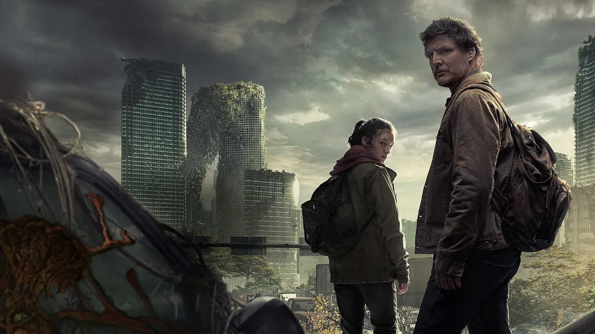
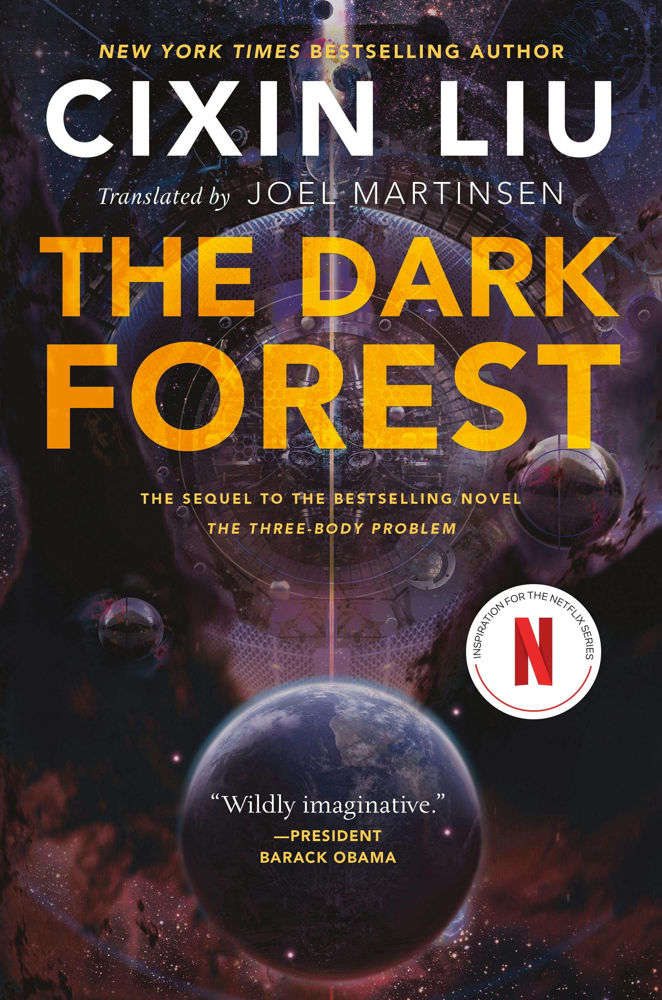
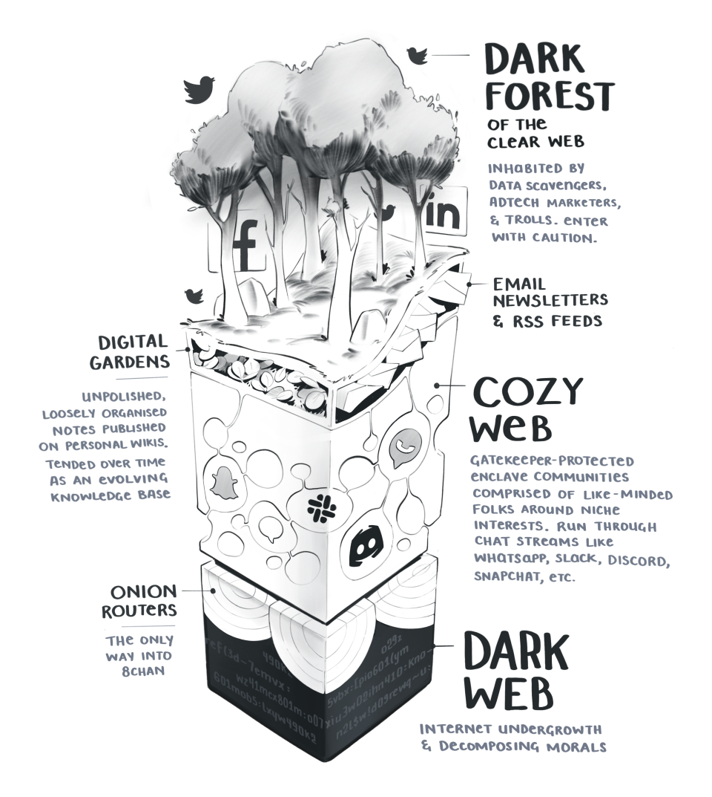

[ Maggie Appleton, "[The Dark Forest & The Cozy Web](https://maggieappleton.com/cozy-web)"     Yancey Strickler, “[The Dark Forest Theory of the Internet](pdf/yancey-strickler-medium-pt1.pdf)”; “[Beyond The Dark Forest Theory of the Internet](pdf/yancey-strickler-medium-pt2.pdf)” (2019)]{.aside}

::: {.content-visible when-format="html"}
[{width="100%"}](https://www.hbo.com/the-last-of-us)
:::

::: {.content-visible when-format="pdf"}

:::

Are you familiar with the post-apocalyptic HBO Max series [*The Last of Us*](https://www.hbo.com/the-last-of-us) (2023), based on the [Playstation game](https://www.playstation.com/en-us/games/the-last-of-us-part-i/) of the same name?

::: {.content-visible .column-margin unless-format="pdf"}

:::

Or maybe Max's previous post-apocalyptic series [*Station 11*](https://www.max.com/shows/station-eleven/) (2022), based on Emily St. John Mandel's [bestselling novel](https://www.emilymandel.com/station-eleven)?

::: {.content-visible .column-margin unless-format="pdf"}

:::

As you probably know, the past few years have seen a growing number of these post-apocalyptic series, along with the by now well-worn zombie-based shows of recent decades. The reasons for the development need not concern us here, although suffice to say that both of the above shows can be seen as allegories for the Covid epidemic.

I was thinking about *The Last of Us* again as I was re-reading Maggie Appleton's and Yancey Strickler's articles on the "dark forest theory of the internet", as well as a more recent addition to Maggie Appleton's digital garden that I also highly recommend (see margin for link).["[The Expanding Dark Forest of Generative AI](https://maggieappleton.com/ai-dark-forest)"]{.aside} I'll come back to *The Last of Us* in a moment but have a few other comments first.

Yancey Strickler's "dark forest theory of the internet" frames the current state of the internet as a "dark forest," a concept derived from the contemporary [Chinese science fiction novel](https://us.macmillan.com/books/9780765386694/thedarkforest) by Liu Cixin. I started reading this novel earlier in the year and it's pretty fascinating!

::: column-margin
[{width="200"}](https://us.macmillan.com/books/9780765386694/thedarkforest)
:::

Yancey Strickler's *Medium* articles about the "dark forest" as a metaphor for the predatory world of contemporary social media clearly struck a chord with many, resonating with similarly bleak prognoses of the demise of social media by tech journalists like [Kyle Chakha](https://www.newyorker.com/culture/infinite-scroll/buzzfeed-blue-check-marks-and-the-end-of-an-internet-era).

Maggie Appleton took up the "dark forest" concept, connecting it to a different concept, the "Cozy Web," as an alternative space of online communication off the radar of algorithms, automated tracking, and targeted advertising of commercial social media platforms. We could think of the Cozy Web as a kind of interstitial space, the cracks in the pavement where people are gathering to escape the Big Brother-like gaze of surveillance capitalism. Appleton describes these spaces as

::: column-margin
        See Shoshana Zuboff, [*The Age of Surveillance Capitalism: The Fight for a Human Future at the New Frontier of Power*](https://www.hachettebookgroup.com/titles/shoshana-zuboff/the-age-of-surveillance-capitalism/9781610395694/?lens=publicaffairs) (New York: Hachette Book Group, 2019).
:::

> tiny underground burrows of Slack channels, Whatsapp groups, Discord chats, and Telegram streams that offer shelter and respite from the aggressively public nature of Facebook, Twitter, and every recruiter looking to connect on LinkedIn.

::: column-margin
{.lightbox width="200"}
:::

At this point we might pause to consider the "dark forest" concept itself, and I wonder what your own response is to it. It's notable that neither Strickler nor Appleton offer any evidence in support of the theory, in terms of a migration away from commercial SM platforms to the untrackable spaces they describe.

The authors would no doubt argue that this is precisely why it's hard to provide hard data to support the theory. Does the "dark forest" theory make sense to you intuitively, or based on your own experience? Or is it just meant to be a catalyst for conversation about the dynamics of social media?

I've thought a lot about the idea of the internet as a "dark forest." Intuitively it seems to make sense, albeit in a somewhat dystopian way, and it's of course easy to frame Elon Musk, Mark Zuckerberg, Jeff Bezos, and other tech billionaires as the social media "predators" that Strickler and Appleton refer to.

At the same time, we need to remember that the "dark forest" idea is simply a metaphor, or a narrative; and that other metaphors, other narratives, are therefore also possible frames for thinking about the social mediascape today.

### The Sorcerer's Apprentice

This is where Maggie Appleton's follow-up article about the increasing encroachment onto social media platforms of Large Language Models (LLMs, aka ChatGPT and similar systems), ["The Expanding Dark Forest of Generative AI" (cited above)]{.aside} becomes particularly thought-provoking. As Appleton puts it, "These new models are poised to flood the web with generic, generated content."

Appleton's anxiety about social media being **flooded** with generative content (or "cruft" as she calls it) brings to mind the folktale of the "Sorcerer's Apprentice," immortalized in Goethe's poem and the famous sequence in Disney's *Fantasia* (1940), in which Mickey Mouse inadvertently floods the magician's basement as the broomsticks he has magically automated run amok.

::: column-margin

:::

For me, this idea of generative content as a kind of virus taking over social media brings to mind not the idea of a "dark forest" of creatures hiding from predators, but a more urban metaphor: the post-apocalytic city of *The Last of Us*, increasingly colonized by the malignant Cordyceps fungus. Interesting, species like Cordyceps are a form of underground mycelial network that is analogous to the technogical networks of the internet and social media.[Here's a nice explainer about [mycelial networks.](https://www.kew.org/read-and-watch/fungi-hidden-dimension)]{.aside} It's a different kind of metaphor but one that for me makes more sense than the "dark forest" idea.

So from this perspective, can we think of the two surviving characters of *The Last of Us* as metaphors for ourselves, trying to avoid the mycelial networks of algorithmic surveillance as they continue to worm themselves into our online social spaces? Like those characters, are we condemned to stay out of the open as far as possible, flitting between abandoned buildings and underground corridors as we navigate through the internet and attempt to make contact with others like ourselves? I leave you to think about how valid this analogy might be as a model for the kind of online world towards which we may be heading in the near future.

------------------------------------------------------------------------
